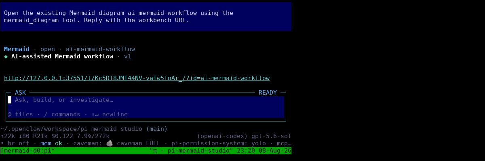
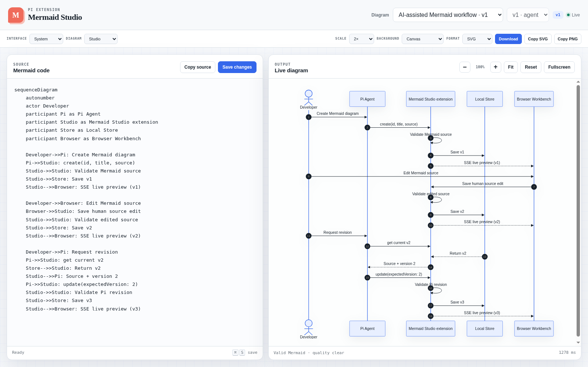

# Pi Mermaid Studio

A stateful Mermaid workbench for Pi: the agent creates and revises diagrams, while you edit Mermaid source beside a live browser preview.

## Demo

Ask Pi to create or open a diagram. The extension exposes one compact tool and returns a capability-protected localhost workbench URL.



The workbench keeps Mermaid source and the rendered diagram side by side. Human edits are validated, versioned, and synchronized back to the active Pi session.



## MVP

- One agent tool: `mermaid_diagram` (`validate`, `create`, `update`, `get`, `list`, `open`)
- Project-local `.mmd` source and JSON version history under `.pi/diagrams/`
- Conflict-safe updates with `expectedVersion`
- Mermaid-native syntax validation before every saved version
- Conservative visual-quality guidance without a second Mermaid parser
- Localhost-only browser workbench with a capability URL
- Mermaid source + live client-side preview
- Direct human edits and SSE refresh when Pi changes a diagram
- Saved-version browsing and restoration as a new draft
- Light, dark, and system interface modes with an independent render theme
- Zoom, pan, fit, reset, and fullscreen preview controls
- Copy Mermaid, SVG, or PNG; download MMD, SVG, PNG, or JPG at 1×/2×/4×
- Transparent or solid export backgrounds
- `/mermaid [id]` command to reopen the workbench

## Install

```bash
pi install git:github.com/irfansofyana/pi-mermaid-studio
```

Try it for one session without installing:

```bash
pi -e git:github.com/irfansofyana/pi-mermaid-studio
```

## Develop locally

```bash
npm install
npm run check
pi -e /absolute/path/to/pi-mermaid-studio
```

Then ask Pi:

> Create a Mermaid sequence diagram for a login flow with MFA, token issuance, and refresh rotation. Open it in Mermaid Studio.

Or run `/mermaid` to open the most recently updated diagram.

## Storage

```text
.pi/diagrams/
├── login-flow.mmd   # canonical, Git-friendly Mermaid source
└── login-flow.json  # metadata and version history
```

The server binds to `127.0.0.1` on an ephemeral port and starts only when a diagram is created, updated, or opened. Mermaid renders in the browser; Chromium is not part of the conversational loop.

## Deliberately out of scope

PDF export, inline terminal images, visual node dragging, public sharing, built-in model configuration, and MCP adapters remain outside this Pi-first release.
