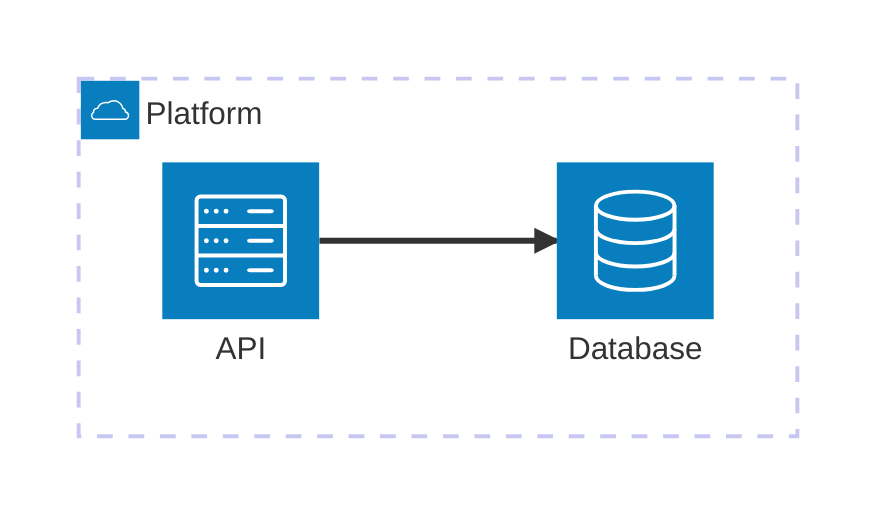

# Architecture diagrams

Pinned documentation baseline: Mermaid 11.16.1
Official source: https://mermaid.js.org/syntax/architecture.html

Use for services, infrastructure resources, groups, and dependency direction.

Skeleton:

Represent evidence-backed boundaries and dependencies. Keep labels operationally meaningful. Avoid an unreadable service cloud, invented components, or combining deployment, request sequence, and domain model in one view.
