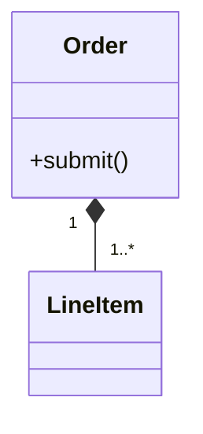

# Class diagrams

Pinned documentation baseline: Mermaid 11.16.1
Official source: https://mermaid.js.org/syntax/classDiagram.html

Use for domain types, responsibilities, inheritance, composition, aggregation, and dependency.

Skeleton:

Show domain-significant members and relationship multiplicities. Omit getters, setters, framework plumbing, and private implementation detail unless they answer the question.
