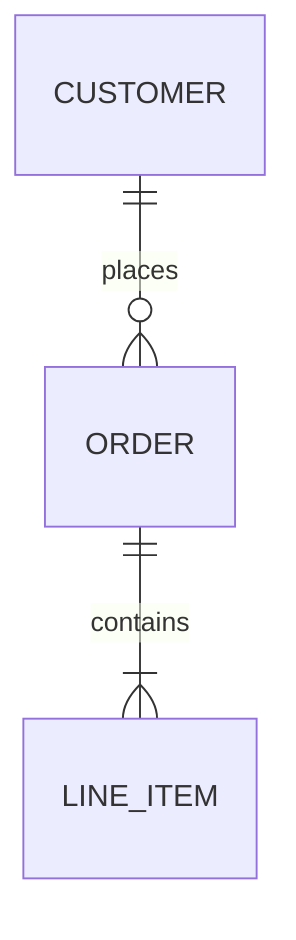

# Entity relationship diagrams

Pinned documentation baseline: Mermaid 11.16.1
Official source: https://mermaid.js.org/syntax/entityRelationshipDiagram.html

Use for logical data entities, cardinality, and optionality.

Skeleton:

Name relationships with concise verbs. Distinguish logical modeling from physical schema detail. Never guess cardinality; mark uncertainty in surrounding prose rather than fabricating precision.
