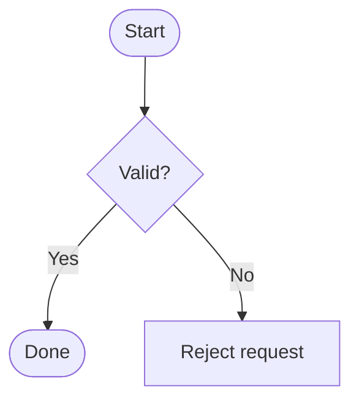

# Flowcharts

Pinned documentation baseline: Mermaid 11.16.1
Official source: https://mermaid.js.org/syntax/flowchart.html

Use for branching processes, algorithms, CI/CD, and operational flows.

Skeleton:

Label decision branches, keep direction consistent, and use subgraphs only for real stages/boundaries. Avoid unlabeled diamonds, crossed back-edges, and mixing system topology with process order.
