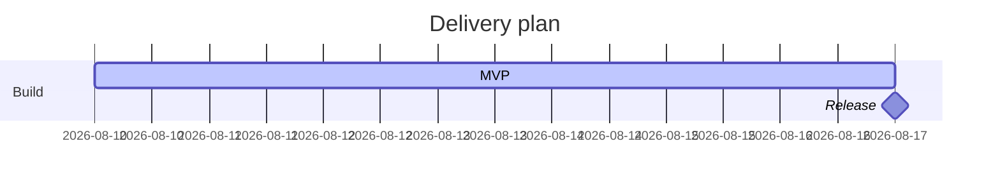

# Gantt charts

Pinned documentation baseline: Mermaid 11.16.1
Official source: https://mermaid.js.org/syntax/gantt.html

Use for phases, dependencies, milestones, and critical work.

Skeleton:

Use stable task IDs and explicit dependencies. Show decision-useful milestones and critical work, not an entire issue backlog. Do not invent dates; request or clearly state scheduling assumptions.
