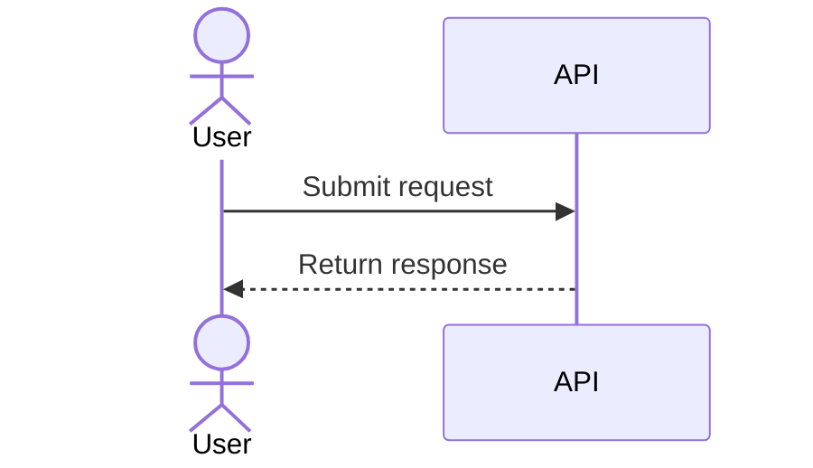

# Sequence diagrams

Pinned documentation baseline: Mermaid 11.16.1
Official source: https://mermaid.js.org/syntax/sequenceDiagram.html

Use for ordered interactions between actors/services.

Skeleton:

Declare participants in meaningful order. Use `alt`, `opt`, `par`, loops, activation, and notes only when they clarify behavior. Show failures/retries when relevant. Avoid turning internal computation into fake participants or narrating every function call.
