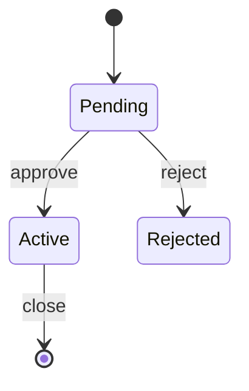

# State diagrams

Pinned documentation baseline: Mermaid 11.16.1
Official source: https://mermaid.js.org/syntax/stateDiagram.html

Use for lifecycles driven by events, guards, and transitions.

Skeleton:

Label transitions with triggers; include guards when behavior depends on conditions. Show failure and terminal states where relevant. Use composite states for real hierarchy, not decoration.
